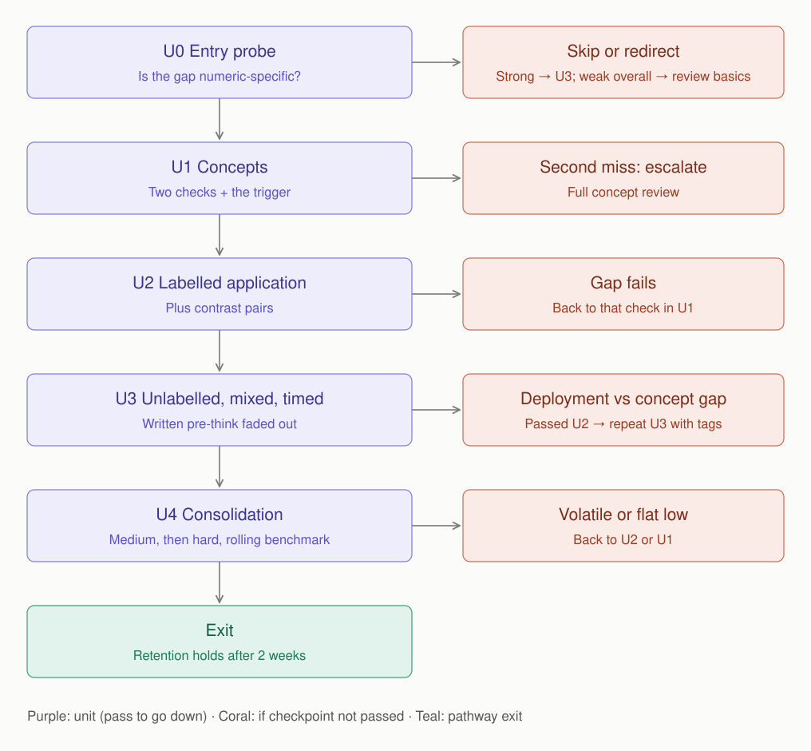

# Adaptive Pathway Design

## 1. Strategy

The pathway follows a standard progression: **concept, labelled application, unlabelled application, consolidation**. The skill must survive the removal of labels, because a real test never announces "this is a numeric argument."

**Four design principles**

1. **Contrast pairs.** Pairs of arguments that differ in one feature only (a count vs a rate; two figures measured alike vs not). They stop the method-reuse that cost Q3, because the same template gives the right answer in one half and the wrong answer in the other.
2. **A visible pre-think, then faded.** First written in full, then reduced to a one-word tag (DENOM, COMPARE or CAUSE), then dropped. The habit has to run without the prop.
3. **Guarding against over-correction.** Valid comparisons are mixed in, so the learner can't pass by attacking every number.
4. **Protecting strengths.** Structure and rival-cause accuracy are tracked from a baseline and must not drop.

## 2. The pathway

| Unit | What it does | Checkpoint |
|---|---|---|
| **U0 Entry probe** | 12 new mixed questions: 6 numeric, 4 non-numeric causal, 2 structure. Confirms the gap is numeric-specific and sets baselines. | A screen, not a verdict. Routes the learner into the full pathway, into a foundation review, or straight to U3. |
| **U1 Concepts** | The two checks plus the trigger protocol (tags DENOM / COMPARE / CAUSE; a 1:30 minimum before choosing). Worked examples built from the learner's own Q3 to Q5. | New stems with no options: Check 1 at least 14 of 15; Check 2 at least 11 of 12. |
| **U2 Labelled application + contrast pairs** | 24 labelled numeric questions across question types; 12 contrast pairs; 8 valid-comparison items. | At least 80% per gap; pairs at least 5 of 6; false alarms at most 1 of 8. |
| **U3 Unlabelled, mixed, timed** | 4 sets of 13, with 20+ numeric questions in total; written pre-think faded out. | Numeric at least 70%; timing floor and ceiling; strengths not below baseline. |
| **U4 Consolidation** | Medium, then hard mixed quizzes; a rolling 20-question benchmark at hard difficulty; retention check after two weeks. | Pathway exit (see `05-evaluate/metrics-and-exit.md`). |

## 3. Branching rules

| At | If | Then | Why |
|---|---|---|---|
| U0 | Numeric at most 3 of 6 **and** non-numeric at least 3 of 4 | Full pathway from U1 | Gap confirmed as numeric-specific |
| U0 | Both low | Foundation review first | The gap is broader than numeric arguments |
| U0 | Numeric at least 5 of 6 | Skip to U3 | U3 confirms on 20+ items whether a gap exists |
| U1 | First miss on a check | New worked examples, fresh stems for that check | |
| U1 | Second miss | Escalate to a full concept review, then retest | A concept gap the pathway alone won't fix |
| U2 | A gap's accuracy fails | Back to that check in U1 (counts toward escalation) | |
| U2 | Pairs fail | Fresh pairs of that type | Method still chosen by habit |
| U2 | False alarms above 1 of 8 | More valid-comparison items | Over-correction |
| U3 | Passed U2, numeric below 70% | Repeat U3 with tags reinstated for one set, then fade again | **Deployment gap** (see below) |
| U3 | Also failed U2 | Back to U1 | **Concept gap** |
| U3 | Unwritten accuracy more than 5 points below written | Stay at the tag stage longer | Habit not yet internalised |
| U4 | Low first quiz, then rising | Continue | Normal dip on first mixed sets |
| U4 | Volatile scores | Back to U2 Part B or U3 if low quizzes were numeric-heavy | Unstable deployment |
| U4 | Flat low scores | Stop; back to U1 | Concept not built |
| U4 | Retention miss after two weeks | Refresh U2 Part B and U3 | Recency, not learning |

## 4. Concept gap vs deployment gap

U2 tells the learner the argument is numeric; U3 doesn't.

- **Passed U2, failed U3:** the learner can apply both checks when told to. What's missing is *recognising* a numeric argument unprompted, in a mixed, timed set. That is a **deployment gap**. More concept teaching won't help, so the learner repeats U3 with the written tags reinstated, then fades them again.
- **Failed U2 as well:** the concept itself isn't built. That is a **concept gap**, so the learner returns to U1, where a second miss escalates to a full concept review.

The five diagnostic questions could not tell these two cases apart. The pathway tells them apart from its own data. **[Judgement]**

## 5. Why this design

1. **One root cause, not three slips.** All six wrong judgements are the same move, and the learner's notes express the same belief each time. Unrelated slips would scatter across option types; these don't.
2. **Targeted, not a course redo.** Foundations and structure are demonstrably solid, so only the gap is revised.
3. **Each threshold has a reason.** Recognition tasks with no traps should be near-perfect, with one slip allowed (14 of 15; 11 of 12). Labelled work should clearly beat the unlabelled bar (80% vs 70%). Pairs prove the method was chosen from the metric (5 of 6). The timing floor and ceiling together close the gaming loophole. Small checkpoints are labelled as screens and confirmed later on 20+ items.
